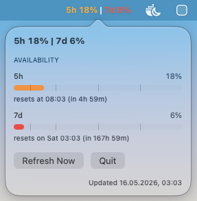
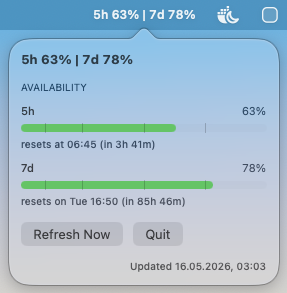

# Codex Usage Menubar

Minimal macOS menu bar app for Codex usage.

## Screenshots

<p>
  
  
</p>

## Start

```bash
./start.command
```

## Download

[CodexUsageMenubar.app.zip](https://github.com/lasseveenliese/codex-usage-menubar/releases/download/latest/CodexUsageMenubar.app.zip)

The app reads the newest Codex session logs from `~/.codex` by default.
Set `CODEX_HOME` before launching if your data lives elsewhere.
To simulate values at launch, set `CODEX_USAGE_MENUBAR_SIMULATE_PRIMARY_USED_PERCENT` and `CODEX_USAGE_MENUBAR_SIMULATE_SECONDARY_USED_PERCENT`.
The app only reads local Codex data and does not send usage information to external services.

`start.command` rebuilds the app and keeps only one instance running.

## Notes

- Updates once per minute.
- Falls back to `Codex -- | weekly --` if no Codex data is found.
